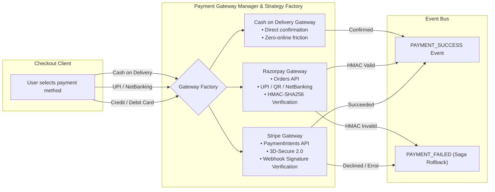
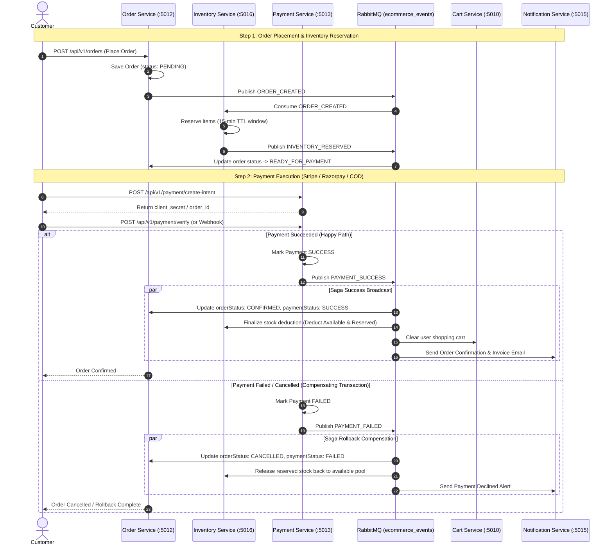

# 🏗️ NexStore Microservices Architecture & Design Specification

An enterprise-grade, distributed e-commerce platform built with **Node.js, Express, MongoDB, RabbitMQ, Redis, and React (Vite)**, implementing **Domain-Driven Design (DDD)**, **Event-Driven Choreography**, **Distributed Saga Orchestration**, and a **Multi-Gateway Real Payment Engine (Stripe & Razorpay)**.

---

## 🏛️ High-Level System Topology

```mermaid
flowchart TB
    subgraph ClientLayer["Frontend & Client Layer"]
        ClientApp["React 19 + Vite Storefront (:5173 / Render)"]
        AISearch["AI Semantic Search & ReAct Assistant"]
        CheckoutUI["Multi-Gateway Checkout (Stripe / Razorpay / COD)"]
        ClientApp --> AISearch
        ClientApp --> CheckoutUI
    end

    subgraph GatewayLayer["API Gateway & Security Layer (:5014)"]
        Gateway["API Gateway Service"]
        RateLimiter["Redis Tiered Rate Limiter (15 - 100 req/min)"]
        JWTMiddleware["JWT Authentication & Claims Validation"]
        CorrTracker["Correlation ID (X-Correlation-ID)"]
        Gateway --> RateLimiter
        Gateway --> JWTMiddleware
        Gateway --> CorrTracker
    end

    ClientApp -->|HTTPS / REST| Gateway

    subgraph CoreServices["Domain Microservices"]
        AuthSvc["Auth Service (:5011)<br/>• JWT & bcrypt<br/>• User Profiles"]
        ProdSvc["Product Service (:5009)<br/>• Catalog & DummyJSON Bridge<br/>• Redis Cache"]
        CartSvc["Cart Service (:5010)<br/>• User Cart State<br/>• Auto-clear on Order"]
        OrderSvc["Order Service (:5012)<br/>• Order State Machine<br/>• Dynamic Coupons Engine"]
        PaySvc["Payment Service (:5013)<br/>• Multi-Gateway (Stripe / Razorpay / COD)<br/>• Idempotency & Webhooks"]
        InvSvc["Inventory Service (:5016)<br/>• 15-Min TTL Reservations<br/>• Atomic Deductions"]
        NotifSvc["Notification Service (:5015)<br/>• Async Email Dispatcher<br/>• DLQ Retry Handler"]
        RevSvc["Review Service (:5017)<br/>• Verified Buyer Reviews<br/>• Rating Aggregation"]
        RefSvc["Refund & RMA Service (:5019)<br/>• Automated 30-Day Returns<br/>• Instant PDF Shipping Labels"]
        AISvc["AI Service (:5018)<br/>• Multi-signal Semantic Reranking<br/>• Natural Language Parser"]
    end

    Gateway --> AuthSvc
    Gateway --> ProdSvc
    Gateway --> CartSvc
    Gateway --> OrderSvc
    Gateway --> PaySvc
    Gateway --> InvSvc
    Gateway --> NotifSvc
    Gateway --> RevSvc
    Gateway --> AISvc

    subgraph Messaging["Event-Driven Message Broker (RabbitMQ)"]
        Exchange["Exchange: ecommerce_events (Topic / Direct)"]
        DLX["Dead Letter Exchange: ecommerce_dlx"]
        
        Q_Inv["order_inventory_queue"]
        Q_Order["order_payment_queue"]
        Q_Notif["notification_order_queue"]
        Q_Cart["cart_clear_queue"]
        
        Exchange --> Q_Inv
        Exchange --> Q_Order
        Exchange --> Q_Notif
        Exchange --> Q_Cart
        Exchange -.->|Failed Retries| DLX
    end

    OrderSvc -->|ORDER_CREATED| Exchange
    InvSvc -->|INVENTORY_RESERVED / FAILED| Exchange
    PaySvc -->|PAYMENT_SUCCESS / PAYMENT_FAILED| Exchange
    Exchange --> OrderSvc
    Exchange --> InvSvc
    Exchange --> CartSvc
    Exchange --> NotifSvc
```

---

## 💳 Multi-Gateway Payment Engine Architecture

The `Payment-Service` implements a **Strategy Pattern** across multiple industry-standard payment gateways with built-in idempotency protection and asynchronous webhook listeners:

### Key Gateway Capabilities
1. **Stripe Integration**:
   - Creates `PaymentIntent` via `stripe.paymentIntents.create` with amount converted to smallest currency units.
   - Public webhook endpoint `/api/v1/payment/webhook/stripe` verifying `stripe.webhooks.constructEvent` with `STRIPE_WEBHOOK_SECRET`.
   - Sandbox/Mock fallback for seamless evaluation without active keys.
2. **Razorpay Integration**:
   - Creates order via `razorpay.orders.create` with smallest currency unit (paise).
   - Validates cryptographic HMAC-SHA256 signature (`order_id + '|' + payment_id`).
   - Webhook verification via `x-razorpay-signature`.
3. **Cash on Delivery (COD)**:
   - Instant transaction generation (`COD_<timestamp>_<orderId>`) with direct `PAYMENT_SUCCESS` broadcast.
4. **Idempotency Protection**:
   - `idempotencyKey` index on Payment records guarantees no duplicate charges during network retries.

---

## 🔄 Distributed Saga Choreography: Order Lifecycle

---

## 📊 Microservices Port & Responsibility Matrix

| Microservice | Port | Database / Storage | Key Responsibilities |
| :--- | :---: | :---: | :--- |
| **API Gateway** | `5014` | Redis (Rate Limiter) | Request routing, JWT claims verification, Tiered rate limiting, Correlation ID propagation, Public webhook bypass |
| **Auth Service** | `5011` | MongoDB (`ecommerce_auth`) | User registration, bcrypt password hashing, JWT creation & token refresh |
| **Product Service** | `5009` | MongoDB + Redis | Product catalog, Category filtering, Live DummyJSON proxying & local caching |
| **Cart Service** | `5010` | MongoDB (`ecommerce_cart`) | Shopping cart management, quantity adjustments, auto-clearing upon `ORDER_CONFIRMED` |
| **Order Service** | `5012` | MongoDB (`ecommerce_order`) | Order state machine (`PENDING` ➔ `READY_FOR_PAYMENT` ➔ `CONFIRMED` ➔ `CANCELLED`), Coupon code discounts |
| **Payment Service** | `5013` | MongoDB (`ecommerce_payment`) | **Multi-Gateway Engine (Stripe, Razorpay, COD)**, Cryptographic Webhook signatures, Idempotency keys, Saga event emission |
| **Inventory Service** | `5016` | MongoDB (`ecommerce_inventory`) | Concurrency-safe stock management, 15-minute TTL reservation hold, Atomic stock commits & rollbacks |
| **Notification Service** | `5015` | MongoDB (`ecommerce_notification`) | Asynchronous event listener, Email dispatch, Dead Letter Queue (DLQ) retry mechanism |
| **Review & Rating Service** | `5017` | MongoDB (`ecommerce_review`) | Verified buyer reviews, 5-star ratings, aggregate product ratings |
| **Refund & RMA Service** | `5019` | MongoDB (`ecommerce_refund`) | 30-day return policy enforcement, Automated return requests, instant PDF return shipping label creation |
| **AI Shopping Assistant** | `5018` | In-Memory / Vector Cache | Multi-signal semantic search & scoring, ReAct reasoning steps, 24-category word-boundary taxonomy |

---

## ⚡ Resilience & Reliability Patterns

1. **Correlation Tracking**:
   - Every HTTP request receives an `X-Correlation-ID` header (e.g. `web-1787742...`) at the API Gateway and is propagated across all inter-service REST calls and RabbitMQ event headers for end-to-end distributed tracing.
2. **Dead Letter Exchange (DLX)**:
   - Failed RabbitMQ messages are routed to `ecommerce_dlx` with exponential backoff before triggering dead-letter alerts.
3. **Idempotency Guarantee**:
   - Payments and Orders enforce unique composite indexes (`orderId`, `idempotencyKey`) preventing duplicate charges on retry bursts.
4. **Graceful Sandbox Simulation**:
   - The platform dynamically detects presence of live third-party keys (`STRIPE_SECRET_KEY`, `RAZORPAY_KEY_ID`); in their absence, verified mock engines simulate 100% of real API contracts without throwing runtime errors.
